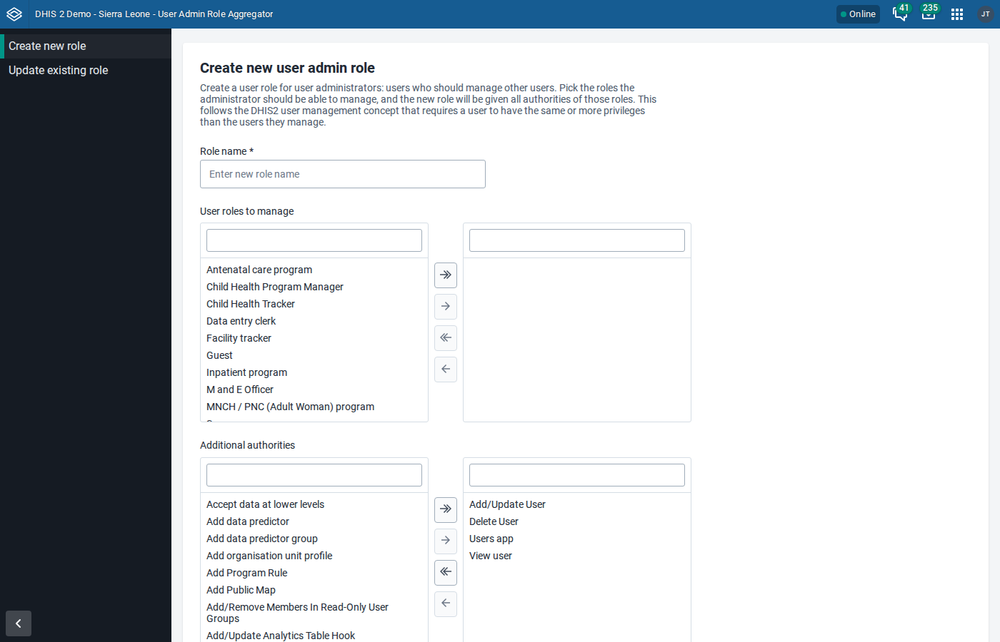
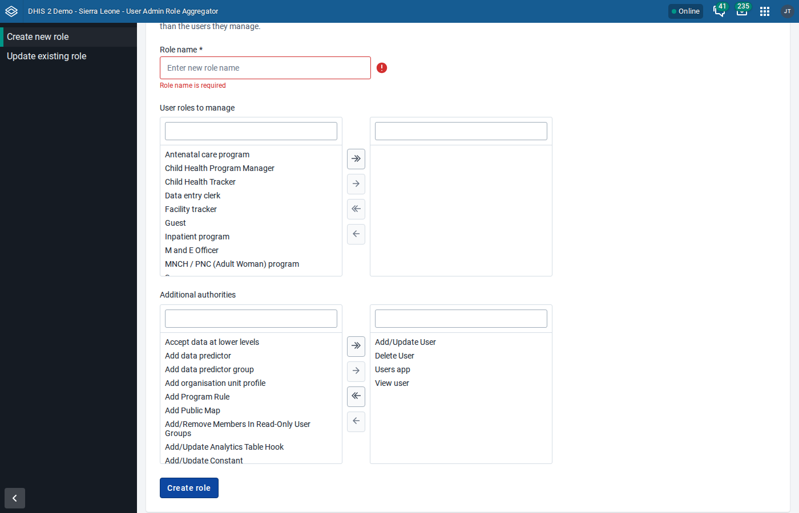
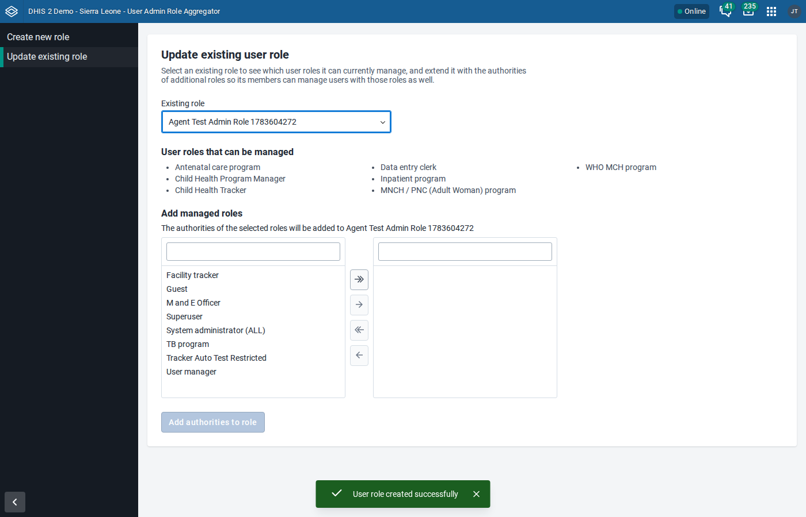
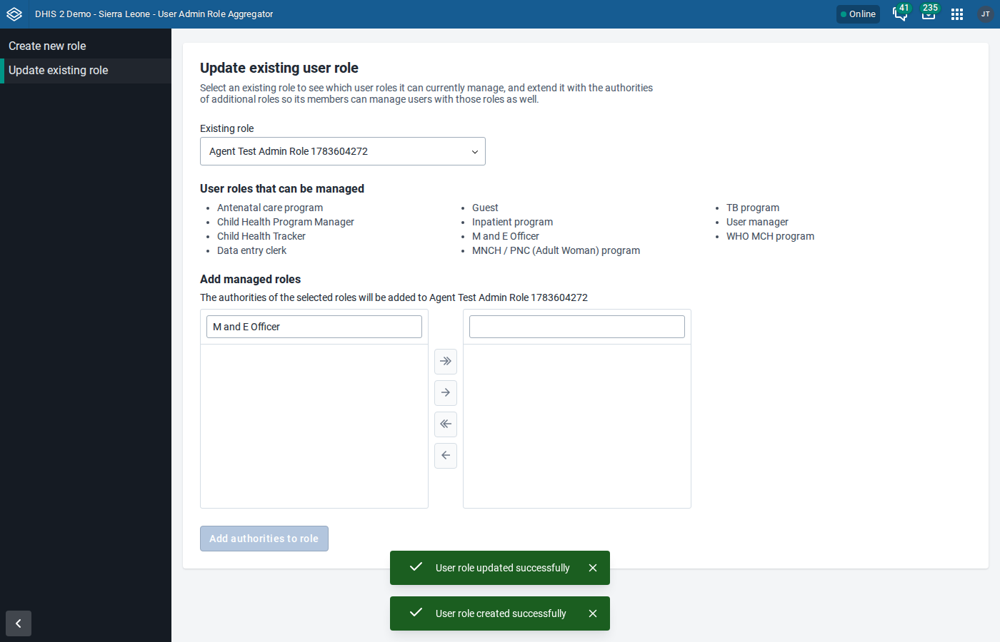
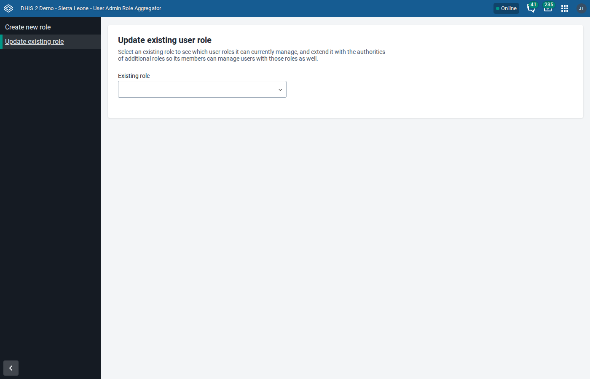
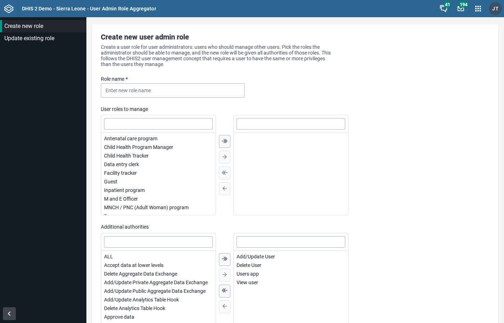
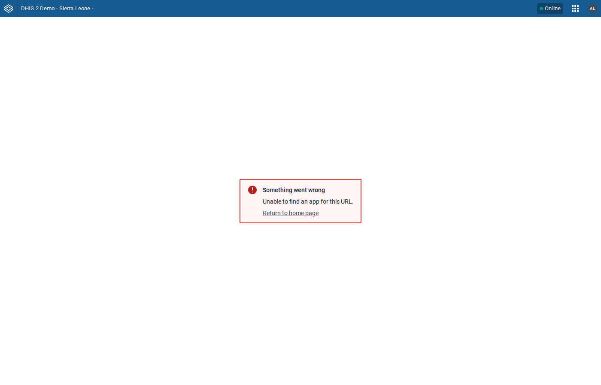

# UI test results: User Admin Role Aggregator v1.0.0

Tested: 2026-07-09 · App under test: production bundle (`build/bundle/user-role-aggregator-1.0.0.zip`) installed via `POST /api/apps` · Test data: Sierra Leone demo seeds

Suite: Playwright (Chromium), session-cookie auth, all four event streams captured (console, pageerror, requestfailed, HTTP ≥ 400). Every mutating flow is verified through the API afterwards, not just through UI feedback. Suite source: `tests/e2e/suite.py` + `tests/e2e/extra_tests.py`.

## Instances

| Label | URL                                    | DHIS2 version | Source                                                                 |
| ----- | -------------------------------------- | ------------- | ---------------------------------------------------------------------- |
| 2.40  | http://dhis2-agent-review-ura-240:8080 | 2.40.12       | broker, seed `dhis2-db-sierra-leone_V40.sql.gz` (deleted after review) |
| 2.43  | http://dhis2-agent-review-ura-243:8080 | 2.43.0.1      | broker, seed `dhis2-db-sierra-leone_v43.sql.gz` (deleted after review) |

## Results

Final run, after the review fixes (M1/L1/L2 in `REVIEW-FINDINGS.md`) were applied.

| Step                                                       | 2.40                       | 2.43                       | Notes                                                               |
| ---------------------------------------------------------- | -------------------------- | -------------------------- | ------------------------------------------------------------------- |
| API preflight: userRoles / authorities shapes              | PASS (14 roles, 230 auths) | PASS (15 roles, 220 auths) | envelope shapes identical                                           |
| Install bundle via `/api/apps`                             | PASS (204)                 | PASS (201)                 |                                                                     |
| App loads, create page renders                             | PASS                       | PASS                       |                                                                     |
| Roles transfer populated (admin sees all roles)            | PASS (13)                  | PASS (14)                  | own-superuser filtering applies                                     |
| Default authorities preselected                            | PASS (4)                   | PASS (4)                   | Add/Update User, Delete User, Users app, View user                  |
| Validation: empty submit rejected, no request sent         | PASS                       | PASS                       | "Role name is required" shown                                       |
| Create role (aggregate "Data entry clerk" + defaults)      | PASS                       | PASS                       | success AlertBar                                                    |
| API verify: new role ⊇ clerk authorities + defaults        | PASS (10 auths)            | PASS (8 auths)             | no authority lost                                                   |
| Update page renders                                        | PASS                       | PASS                       |                                                                     |
| Managed-roles list correct for created role                | PASS (9)                   | PASS (9)                   | includes Data entry clerk                                           |
| Add authorities from "M and E Officer"                     | PASS                       | PASS                       | success AlertBar                                                    |
| Managed list refreshes without reload (cache invalidation) | PASS                       | PASS                       | M and E Officer appears                                             |
| API verify: authorities merged, `description` preserved    | PASS                       | PASS                       | PUT did not drop owner fields                                       |
| Global shell wraps app, URL syncs on navigation            | n/a (no global shell)      | PASS                       | `#/update` ↔ `#/`, no page errors                                   |
| Limited user (Data entry clerk only): app access           | n/a                        | WARN                       | platform blocks app entirely without app authority — see finding L5 |
| Cleanup: created role deleted                              | PASS                       | PASS                       |                                                                     |

**20/20 scripted steps passed on each version; no FAILs.** The same suite also passed on 2.40 before the review fixes (the M1 staleness scenario requires a concurrent editor, which the suite does not simulate).

## Version-specific failures

None. One version-specific _auth_ difference affects tests, not the app: 2.40 has no `POST /api/auth/login` (it 302s to the legacy login page); Basic-auth against `/api/me` yields the session cookie on both versions.

## Console/network hygiene

- Both versions: `PWA features will not work` console error — platform PWA code on plain-HTTP test instances; not app code.
- Both versions: 404 on `/api/staticContent/logo_banner` — instance has no custom logo; requested by the header bar, not the app.
- No page errors, no failed app API requests on either version.

## Screenshots

Copied to `review-artifacts/` (safe to delete):

- 
- 
- 
- 
- 
- 
- 
