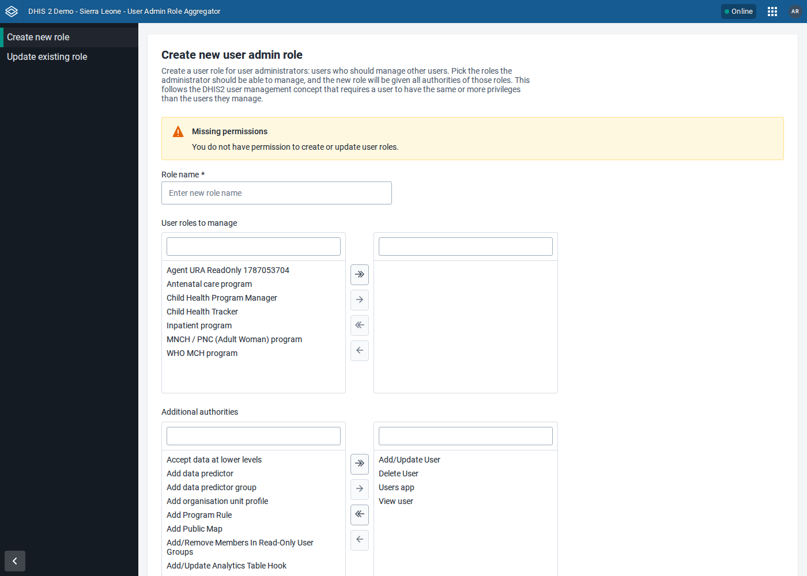
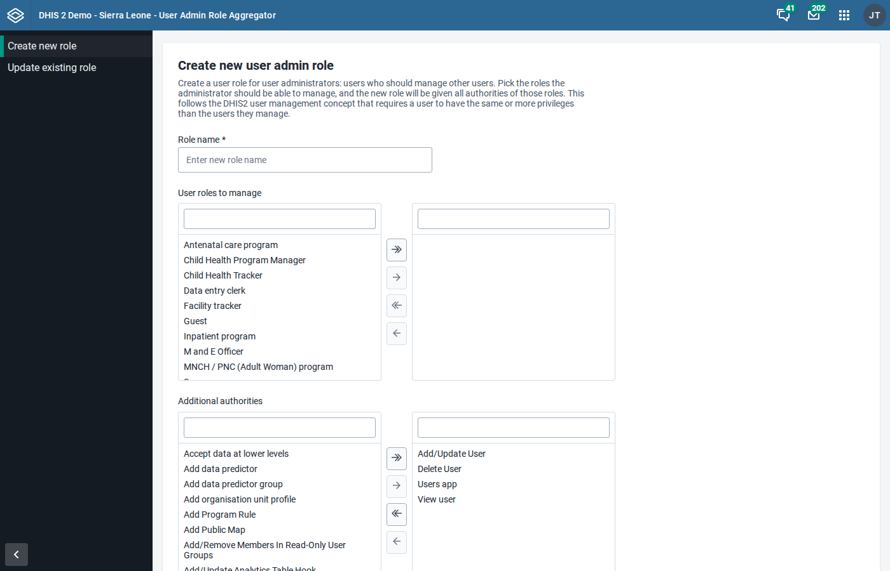
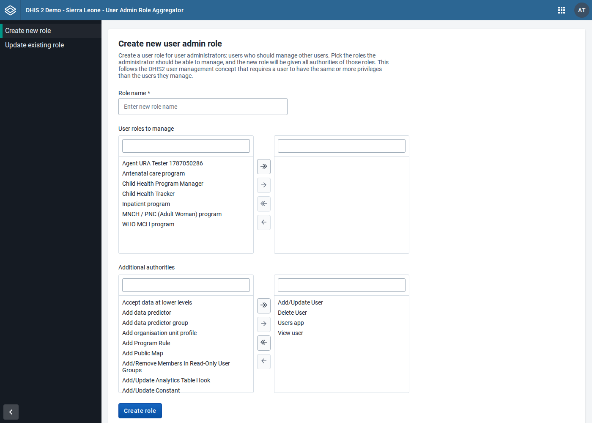

# UI test results: User Admin Role Aggregator 1.0.0 on DHIS2 2.41 and 2.42

Tested: 2026-08-18 · App under test: production bundle `tool-user-role-aggregator-1.0.0.zip` installed via `POST /api/apps` · Test data: Sierra Leone demo seeds

Release-readiness run before the 1.0.0 tag. It closes the 2.41 and 2.42 gaps left by the [migration review](../review-2026-07-09/UI-TEST-RESULTS.md) (which covered 2.40 and 2.43), and adds coverage the earlier run lacked: the app driven by a **non-superuser**. The app source is unchanged since that review; this run also exercises the app key `tool-user-role-aggregator`.

With 2.40, 2.41, 2.42 and 2.43 all covered, every version from the declared minimum to the current release has been tested.

## Instances

Both created from broker seeds and deleted after the run.

| Label | DHIS2 version | Seed                               |
| ----- | ------------- | ---------------------------------- |
| 2.41  | 2.41.9.1      | `dhis2-db-sierra-leone_v41.sql.gz` |
| 2.42  | 2.42.5.2      | `dhis2-db-sierra-leone_v42.sql.gz` |

## `tests/e2e/suite.py` — 20 steps, 0 FAIL on each version

| Step                                                       | 2.41                       | 2.42                       |
| ---------------------------------------------------------- | -------------------------- | -------------------------- |
| API preflight: system/info, userRoles, authorities         | PASS (16 roles, 216 auths) | PASS (16 roles, 227 auths) |
| Install bundle via `/api/apps`                             | PASS (204)                 | PASS (201)                 |
| App registered under the app key                           | PASS                       | PASS                       |
| App loads, create page renders                             | PASS                       | PASS                       |
| Roles transfer populated                                   | PASS (14 options)          | PASS (14 options)          |
| Default authorities preselected                            | PASS (4)                   | PASS (4)                   |
| Validation: empty submit rejected                          | PASS                       | PASS                       |
| Create role (aggregating "Data entry clerk" + defaults)    | PASS                       | PASS                       |
| API verify: created role aggregates authorities            | PASS (9 auths)             | PASS (8 auths)             |
| Update page renders, managed-roles list correct            | PASS (9 managed)           | PASS (9 managed)           |
| Add authorities from "M and E Officer"                     | PASS                       | PASS                       |
| Managed list refreshes without reload (cache invalidation) | PASS                       | PASS                       |
| API verify: authorities merged, `description` preserved    | PASS                       | PASS                       |
| Cleanup: created role deleted                              | PASS                       | PASS                       |

## `tests/e2e/extra_tests.py`

| Step                                        | 2.41                              | 2.42                                                    |
| ------------------------------------------- | --------------------------------- | ------------------------------------------------------- |
| Global shell wraps the app in an iframe     | SKIP (no global shell below 2.42) | PASS                                                    |
| URL syncs with the shell on navigation      | SKIP                              | PASS (`#/update` ↔ `#/`, and back)                      |
| No page errors during shell navigation      | SKIP                              | PASS                                                    |
| Limited user (Data entry clerk only) access | WARN                              | WARN — shell shows "Unable to find an app for this URL" |
| Cleanup: limited user deleted               | PASS                              | PASS                                                    |

The limited-user WARN is expected: without the app's access authority the platform never loads the app, so the app's own warning cannot appear (finding L5 in the July review).

## `tests/e2e/nonsuperuser_test.py` — 18 steps, 0 FAIL (run on 2.42)

The July review only drove the app as a superuser, where every role is manageable and `canManageRole()` is never really exercised.

**A user who may manage roles** — holding only `F_USER_ADD`, `F_USER_VIEW`, `F_USER_DELETE`, `F_USERROLE_PUBLIC_ADD`, `M_dhis-web-user` and the app authority `M_tooluserroleaggregator`:

| Check                                                              | Result                                        |
| ------------------------------------------------------------------ | --------------------------------------------- |
| App loads, no "missing permissions" warning                        | PASS                                          |
| "User roles to manage" lists exactly what `canManageRole()` allows | PASS (7 of 17 roles, matched against the API) |
| Create role with the preselected defaults                          | PASS                                          |
| API verify: created role holds exactly those four authorities      | PASS                                          |
| No page errors                                                     | PASS                                          |

**A user who can open the app but not manage roles** — app authority plus `F_USER_VIEW` only:

| Check                                           | Result |
| ----------------------------------------------- | ------ |
| App renders the "Missing permissions" NoticeBox | PASS   |
| Create button disabled                          | PASS   |

## Console / network hygiene

No page errors and no failed app API requests on either version. Only two distinct messages, both from outside the app:

- `This window is not a secure context … PWA features will not work` — platform PWA code on plain-HTTP test instances (logged twice as often on 2.42, once per shell/app frame)
- `404 /api/<version>/staticContent/logo_banner` — requested by the header bar; the instances have no custom logo
- 2.41 only: styled-jsx `illegal rule` warnings for `-moz-`/`-ms-` prefixed selectors, from `@dhis2/ui`

## Observations (not app defects)

- **Users need the app's access authority to open the tool.** It is `M_tooluserroleaggregator`, listed in the authority picker under the app's name; DHIS2 derives it from the app key minus non-alphanumeric characters. Since the previous key `tool_user_role_aggregator` normalises to the same string, roles that granted access to the old tool should also grant access to this one.
- **`GET /api/authorities` returns 500 on a freshly booted 2.41.9** (`Struts Dispatcher.getInstance() is null`) until something has loaded the legacy web layer once; the app calls this endpoint and would show its "Error loading data" notice. Loading any DHIS2 page (including the login page) primes it, so a browser user normally never sees it — but an app opened as the very first request after a restart can.

